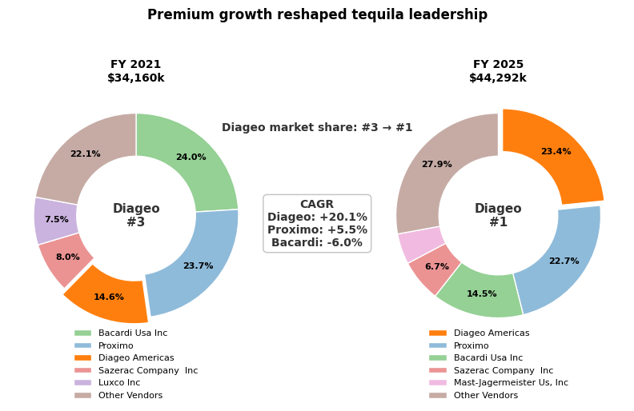
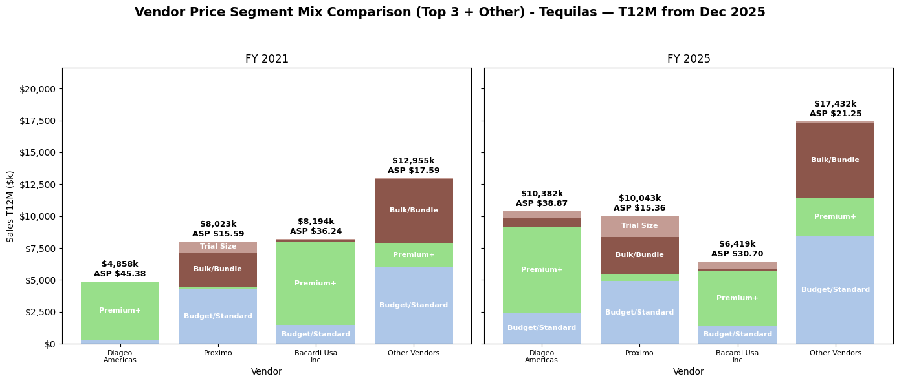

# planning_os

## Business Question

Which products are driving the business — and what's getting in the way of seeing it clearly?

That question shows up in every retail and CPG context. The answer requires looking at the same data from two angles simultaneously: the market dynamics that determine which vendors and categories are winning, and the operational structure that determines which SKUs are earning their place on the shelf.

`planning_os` is an end-to-end analytics system built to answer both questions from a single, well-designed data infrastructure — without rebuilding logic for each view.

---

## What This Project Demonstrates

The system is built on publicly available Iowa Liquor Sales data — 12M+ rows of wholesale transaction data modeled in Snowflake with dbt. Iowa operates as a control state where the government is the wholesaler, making transaction-level data a public record. The analytical approach mirrors how syndicated datasets like Nielsen and Circana are used in category management and planning practice.

## Flagship Analysis: Tequila Market 2021–2025

**Finding:** Diageo moved from #3 to #1 with a +20% CAGR 
while Bacardi declined at -6% — driven by portfolio depth 
across premium expressions, not price positioning alone.



**Price architecture explains the divergence.**
Diageo expanded across premium tiers while maintaining ASP. 
Bacardi concentrated around a single franchise and lost 
ground on both volume and pricing power simultaneously.



→ Full analysis: notebooks/01_category_growth_analysis.ipynb

The repo contains three primary analytical artifacts backed by the modeled warehouse:

- `notebooks/01_category_growth_analysis.ipynb` — flagship market dynamics case study covering tequila growth, vendor share shift, price architecture, and channel mix
- `notebooks/02_sku_velocity_analysis.ipynb` — SKU rationalization and catalog productivity using dual-dimension Pareto classification across volume and revenue
- `notebooks/03_store_performance_analysis.ipynb` — store and channel productivity analysis across chains, independents, and retail formats

The tequila case study is the clearest end-to-end example, but all three notebooks are powered by reusable SQL templates in `analysis/sql/`, common chart helpers in `analysis/python/charts.py`, and dbt marts rather than notebook-only logic.

---

## Key Findings

**Flagship market dynamics:**
- Tequila was the strongest-performing major spirits category from 2021-2025 even as the broader market softened
- Diageo's leadership shift was driven by portfolio depth across premium expressions — not price positioning alone
- Bacardi lost both volume and pricing power simultaneously despite premium positioning — concentration without breadth is a structural liability when the category is moving
- Category-level premiumization in tequila is driven by the top vendors — the long tail is not premiumizing at the same rate

**Operational planning:**
- The catalog follows a classic long-tail pattern: a small share of SKUs drives a disproportionate share of statewide volume and revenue
- Catalog bloat is structural, not marginal — roughly 55-60% of active SKUs sit in the Zombie tier statewide
- Bloat severity varies significantly by category: Specialty/Other Spirits at 79% Zombie share vs. Vodkas at 45%
- The Core tier contains at least two meaningfully different planning archetypes requiring different management approaches

**Store and channel structure:**
- Store performance is heterogeneous across retail formats, with different operating models showing materially different revenue productivity
- Independent stores remain commercially meaningful as a group even when large chains dominate individual rankings

**Data and system:**
- Because the dataset reflects wholesale sell-in rather than consumer sell-through, weekly aggregation is more reliable than daily demand-style interpretation
- Negative sales and bottle values observed in late July 2022 were validated as return invoices (RINV-), not transformation errors
- The source dataset contains limited native dimensions — category families, store chains, and price position segments were all engineered from the ground up

---

## Architecture

```text
Iowa Liquor Sales API
    → Python Ingestion (parameterized, batched)
    → Snowflake RAW schema
    → dbt (staging → intermediate → marts → snapshots)
    → Analysis (Jupyter notebooks + reusable chart and SQL layers)
```

### Components

- **Ingestion**: Parameterized Python pipeline with date range control, batch sizing, and Snowflake connection management
- **Warehouse**: Snowflake with RAW and DEV schemas — raw data preserved for ELT flexibility
- **Transformations**: dbt project with full model layering
  - `staging` → views (lightweight, rebuilt on query)
  - `intermediate` → views (business logic, not persisted)
  - `marts` → tables (pre-computed for query performance)
  - `snapshots` → tables (Type 2 SCD history)
- **Analysis**: Jupyter notebooks backed by reusable SQL templates and Python chart helpers — business logic stays versioned outside notebook cells
- **CI/CD**: GitHub Actions workflow builds a CI-specific dbt environment, runs staged model execution, snapshots, marts build, singular tests, and source freshness checks

---

## Data Model

### Fact Tables
- `fct_liquor_sales` → atomic grain (invoice line)
- `fct_store_daily_sales` → aggregated grain (store × day)
- `fct_sku_velocity` → trailing-12-week SKU Pareto classification across volume and revenue
- `fct_replenishment_forecast` → baseline weekly replenishment recommendation using recent depletion trends

### Dimension Tables
- `dim_store` → Type 1 (current-state), derived from `snap_store`
- `dim_item` → Type 1 (current-state), derived from `snap_item`
- `dim_item_business_history` → final analyst-facing Type 2 (SCD) historical item dimension
- `int_item_business_history` → historical version construction from business-date change points
- `int_item_business_pricing_history` → package-size normalization, normalized pricing, and price position segmentation

### Snapshots
- `snap_store` → Type 2 (SCD), full store attribute history (system-time based)
- `snap_item` → Type 2 (SCD), full item attribute history (system-time based)

---

## Engineered Dimensions

The Iowa source dataset contains limited native dimensions. Three key dimensions were engineered from the ground up:

**Category families** — Iowa data contains granular category codes but no family-level grouping. A curated mapping classifies categories into families (Whiskies, Tequilas, Vodkas, Rum, etc.) enabling market-level analysis.

**Store chains** — Store names in the source data are unstructured. A pattern-based classification identifies chain affiliation (Hy-Vee, Sam's Club, Walmart, etc.) vs. independent stores, enabling channel-level analysis.

**Price position segments** — No price tier exists in the source data. A dual-signal classification model uses retail bottle price and price per 100ml to assign each SKU to a price position segment (Value, Standard, Premium, Super Premium, Ultra Premium, Luxury, Icon/Collectible). Bundle packs are excluded from price-per-volume calculations. Sizes between 680-720ml are normalized to 750ml. Trial formats receive separate tier handling. Definitions are consistent with industry convention.

---

## Known Data Limitations and Modeling Decisions

**Sell-in vs. sell-through:** The dataset represents store purchases from the state (wholesale sell-in), not consumer purchases (sell-through). Daily data reflects ordering behavior, not consumer demand. Weekly and monthly aggregation is more appropriate for demand-style analysis. Raw source data is preserved in the PLANNING_OS.RAW schema before transformation, allowing reprocessing from source without re-ingestion.

**Returns handling:** Source data includes legitimate return invoices identified by invoice numbers starting with RINV-. Return rows are typically negative. A custom data quality test (`assert_negative_values_must_be_returns`) ensures negative values only appear on RINV invoices. Anomalous returns (positive RINV records) are identified in `int_anomalous_returns` and monitored periodically — rare but preserved to maintain data lineage.

**Bundle pack exclusion:** Bundle and multi-pack items are excluded from price-per-100ml calculations — a single transaction representing a large pack at an inflated per-unit price would distort the price tier classification. Bundle packs are flagged separately in the historical item dimension and may be grouped into `bulk_or_bundle` in analysis-layer visuals.

**Historical pricing logic:** Item attributes — including price — change over time. The intermediate history and pricing layers capture attribute history with business-effective dating and derive normalized price semantics before exposing them through `dim_item_business_history`, allowing analysis to use the price that was true at the time of each transaction rather than only the current price.

**Duplicate invoice handling:** The intermediate layer deduplicates invoice lines before fact construction — the source occasionally contains duplicate records that would distort aggregations if not removed.

---

## Current State

**Ingestion and warehouse:**
- Parameterized ingestion pipeline loading source data into PLANNING_OS.RAW
- Historical coverage extends through 2025 and continues forward as new source data becomes available

**dbt modeling:**
- Full model layering: staging → intermediate → marts → snapshots
- Type 2 SCD snapshots for store and item history
- Current-state Type 1 dimensions derived from snapshots
- Engineered dimensions: category families, store chains, price position segments

**Data quality:**
- Return-aware quality policy implemented (`assert_negative_values_must_be_returns`)
- Anomalous returns monitoring (`int_anomalous_returns`)
- Unlabeled negative return monitoring (`int_unlabeled_negative_returns`)
- Grain integrity, reconciliation, and date coverage tests
- Pipeline health monitoring view (`MON_PIPELINE_HEALTH`)
- Deduplicated intermediate invoice layer protecting downstream fact grain integrity

**CI and workflow:**
- GitHub Actions dbt CI workflow builds against a dedicated CI schema
- CI runs dbt debug, staged model execution, snapshots, marts build, singular tests, and source freshness
- Curated direct dependencies are tracked in `requirements.txt`; exact environment resolution is preserved in `requirements-lock.txt`

**Analysis:**
- Category growth and vendor share analysis completed — tequila market 2021-2025
- SKU rationalization and catalog productivity analysis completed — statewide market
- Store performance and channel structure analysis completed — chain vs. independent productivity and revenue concentration
- Reusable chart layer (`analysis/python/charts.py`) and SQL template layer (`analysis/sql/`)
- Notebook helper utilities (`analysis/python/notebook_helpers.py`)

---

## Next Steps

- Add Airflow orchestration — DAG to automate the weekly ingestion → dbt build → dbt test → monitoring sequence
- Synthetic demand layer — simulate consumer demand from sell-in patterns to enable inventory position modeling
- NRF 4-5-4 fiscal calendar dimension — enable period-comparable analysis across the standard retail planning calendar
- Store-level planning simulation — model replenishment at the store level for a subset of stores across different demand profiles

---

## Quickstart

```bash
# Enter environment
source ./enter.sh

# Run environment checks
./doctor.sh

# List available commands
./run.sh help

# Validate dbt configuration
./run.sh dbt-debug
```

## Dependencies

- `requirements.txt` → curated direct dependencies used to install the project cleanly
- `requirements-lock.txt` → exact resolved environment for reproducibility

---

## Canonical Metrics

The repo now defines a small canonical metrics layer in [`dbt/models/docs/metric_definitions.md`](./dbt/models/docs/metric_definitions.md) so the same business metrics are described consistently across models and analyses.

Core metrics include:
- `sales` → `sum(sale_dollars)`
- `units` → `sum(bottles_sold)`
- `avg_selling_price` → `sum(sale_dollars) / sum(bottles_sold)`
- `gross_profit` → estimated gross profit proxy from sales less bottle cost
- `share_pct` and `vendor_share` → share-of-total metrics with explicit scope
- `yoy_growth_pct` and `cagr` → standardized growth-rate definitions for time-window comparisons

These definitions complement reusable column docs in [`dbt/models/docs/column_definitions.md`](./dbt/models/docs/column_definitions.md) and reinforce that business meaning is defined once, then reused across marts, notebooks, and presentation layers.

---

## Quality Gates

The pipeline enforces correctness at every layer:

| Layer | Enforcement |
|---|---|
| Source | Freshness checks — WARN >7d, ERROR >14d |
| Staging | Schema tests — `not_null`, `unique`, `relationships` |
| Intermediate | Deduplication audit, return-aware sign policy |
| Marts | Grain integrity, reconciliation, business rules |
| CI | Staged dbt build across all layers on every push to `dev` |

Full lineage from `RAW_IOWA_LIQUOR` to analytical output is defined in [`dbt/models/exposures.yml`](./dbt/models/exposures.yml).

---

## Pipeline Health

### What constitutes a healthy weekly run

A run is considered **healthy** when all of the following pass:

| Check | Tool | Threshold | Failure type |
|---|---|---|---|
| Source freshness | `dbt source freshness` | loaded within 7 days | WARN > 7d / ERROR > 14d |
| All schema tests | `dbt test` | ERROR=0; documented warn-only exceptions allowed | ERROR blocks merge |
| Grain integrity | `assert_fct_store_daily_no_duplicate_store_day` | 0 rows returned | ERROR |
| Reconciliation | `assert_fct_store_daily_matches_fact_aggregates` | 0 rows returned | ERROR |
| Date coverage | `assert_no_dates_lost_in_staging` | 0 rows returned | ERROR |
| Business rules | `assert_negative_values_must_be_returns` | 0 rows returned | WARN |
| Anomaly monitoring | `int_anomalous_returns`, `int_unlabeled_negative_returns` | Review periodically | INFORMATIONAL |
| Pipeline health view | `MON_PIPELINE_HEALTH.freshness_status` | PASS | WARN/ERROR triggers manual review |

### Run sequence

```bash
dbt source freshness
dbt build
snow sql -c my_snowflake -q "select * from PLANNING_OS.DEV.MON_PIPELINE_HEALTH"
```

### Scheduled weekly run (example)

Use the parameterized pipeline command to run a bounded ingestion window plus snapshot/transform/test:

```bash
./run.sh pipeline \
  --source iowa_liquor \
  --start-date 2021-08-01 \
  --end-date 2021-08-07 \
  --batch-size 1000 \
  --max-batches 300
```

---

## Dimension Design: Type 1 vs Type 2

**Current-state dimensions (Type 1)**
- `dim_store` → latest known attributes per store, derived from `snap_store`
- `dim_item` → latest known attributes per item, derived from `snap_item`

**Historical snapshots (Type 2)**
- `snap_store` → full attribute history per store with `dbt_valid_from` / `dbt_valid_to` effective dating
- `snap_item` → full attribute history per item with `dbt_valid_from` / `dbt_valid_to` effective dating

**Use the current-state dimension when:**
- joining to facts for standard reporting
- you need a single current label per entity

**Use the snapshot directly when:**
- you need to know what attributes were true on a specific date
- you are analyzing trends in entity attributes over time
- you are auditing how a store or item was classified historically

Example — joining a fact row to store attributes that were true at the time of the transaction:

```sql
select
    f.invoice_item_number,
    f.order_date,
    f.sale_dollars,
    s.store_name,
    s.chain
from fct_liquor_sales f
left join snap_store s
    on f.store_number = s.store_number
   and f.order_date >= s.dbt_valid_from
   and (f.order_date < s.dbt_valid_to or s.dbt_valid_to is null)
```

---

## Repository Structure

See: `docs/REPO_MAP.md`
